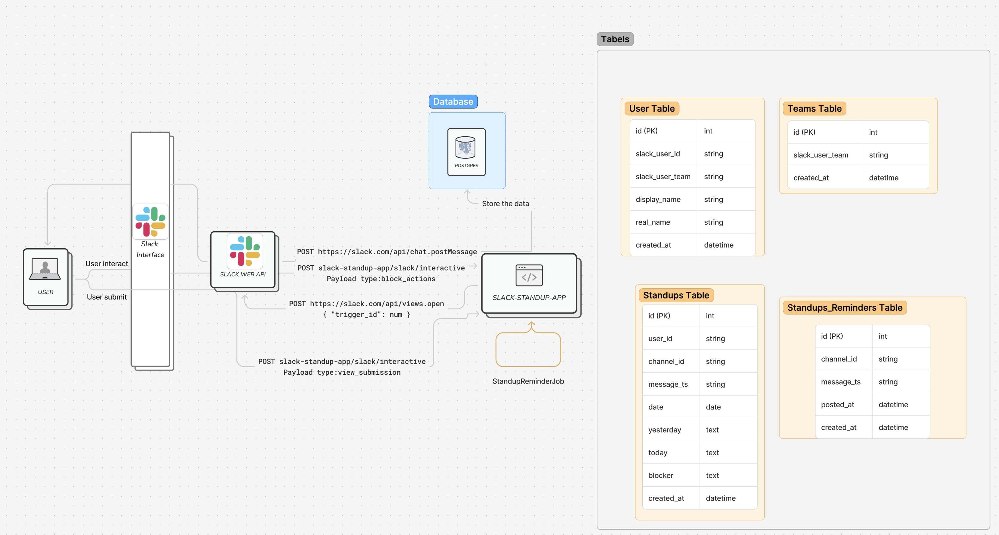
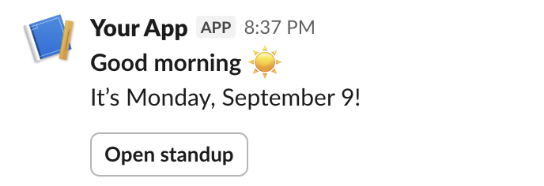

# README

## Architecture



## Slack interactive flow and endpoints
  - Slack Documentation - https://docs.slack.dev/reference/interaction-payloads
- Example request button (posted by the reminder job):


- **1) Job posts a button to a channel**
  - Slack Web API: `chat.postMessage`


- **2) User clicks the button**
  - Service endpoint: `POST /slack/interactive`
  - Payload: `type: "block_actions"` with a short‑lived `trigger_id`.

- **3) Open the modal immediately**
  - Request is validated (Slack signature and timestamp).
  - Slack Web API: `views.open` using the `trigger_id` from step 2.
  - Do not wait for `view_submission`; `trigger_id` expires quickly.

- **4) User submits the modal**
  - Service endpoint: `POST /slack/interactive`
  - Payload: `type: "view_submission"`; form data in `view.state.values`.

- **5) Save and acknowledge**
  - The service parses `view.state.values` and persists the standup (user, channel, date, yesterday, today, blocker, etc.).
  - The service responds with a minimal JSON ack:
    ```json
    { "response_action": "clear" }
    ```
  - Optionally send a confirmation via `chat.postMessage`.

Notes
- The interactivity endpoint can also receive `type: "view_closed"` when a user closes the modal without submitting.


## Request examples (visuals)


First request – `chat.postMessage`



Step 3 – Open the modal
